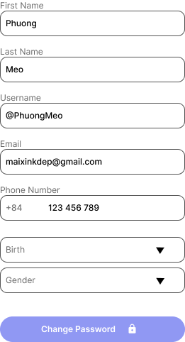

<p align="center">
  
</p>

<h1 align="center">LearnMate</h1>

<p align="center">
  Android app for reading, learning, and studying with AI assistance.
</p>

<p align="center">
  <a href="#features">Features</a> -
  <a href="#screenshots">Screenshots</a> -
  <a href="#setup-and-run">Setup</a> -
  <a href="#related-docs">Docs</a>
</p>

<p align="center">
  
  
  
</p>

## Overview
LearnMate lets users import documents, read by chapters, highlight text with AI, chat, and listen via TTS. It also supports subscriptions and payments.

## Features
- Auth with Google Sign-In and Firebase Authentication
- Book library with featured, recommended, and favorites
- Import PDF, DOC, DOCX, PNG, JPG from device or Google Drive
- Chapter reader with raw and translated modes, bookmarks, and font size control
- AI tools: highlight, chatbot, and text-to-speech
- Subscription and payments via MoMo and ZaloPay

## Tech Stack
- Android (Java), AndroidX, Material Design
- Retrofit, OkHttp, Gson
- Firebase Auth, Google Play Services Auth
- PDFBox Android
- ZaloPay SDK (AAR)

## Setup and Run
1. Update backend base URL at `app/src/main/java/com/example/LearnMate/network/ApiConfig.java`.
   - On Android emulator, you can use `10.0.2.2` instead of `localhost`.
2. Add Firebase config at `app/google-services.json`.
3. (Optional) Create `app/keystore.properties` for release builds:
   ```properties
   storeFile=path/to/keystore.jks
   storePassword=your_store_password
   keyAlias=your_key_alias
   keyPassword=your_key_password
   ```
4. Sync Gradle and run the project.

## Run App
- Android Studio: Run module `app`
- CLI:
  ```bash
  ./gradlew assembleDebug
  ```
  On Windows: `gradlew.bat assembleDebug`

## Related Docs
- ZaloPay integration: `ZALOPAY_INTEGRATION.md`
- AI Upload API spec: `api_spec_updated.json`

## Screenshots
<table>
  <tr>
    <td align="center">
      
      <br><sub>Sign In</sub>
    </td>
    <td align="center">
      
      <br><sub>Home</sub>
    </td>
    <td align="center">
      
      <br><sub>Search</sub>
    </td>
  </tr>
  <tr>
    <td align="center">
      
      <br><sub>Book Details</sub>
    </td>
    <td align="center">
      
      <br><sub>Reader</sub>
    </td>
    <td align="center">
      
      <br><sub>Edit Profile</sub>
    </td>
  </tr>
</table>
